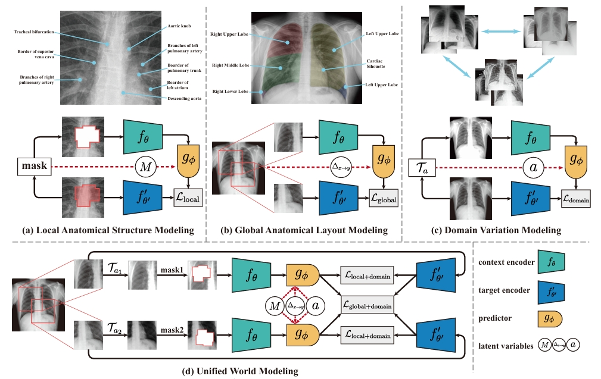

# CheXWorld: Exploring Image World Modeling for Radiograph Representation Learning (CVPR 2025)
Authors: Yang Yue\*, Yulin Wang\*, Chenxin Tao, Pan Liu, Shiji Song, Gao Huang\#.

\*: Equal contribution, \#: Corresponding author.

## Overview

**CheXWorld** is a self-supervised world model for radiographic images, inspired by how humans develop internal models of the world to reason and predict outcomes. It learns key aspects of medical knowledge critical for radiologists, including: 1) **Local anatomical structures** (e.g., tissue shapes, textures), 2) **Global anatomical layouts** (e.g., organ and skeleton organization), and 3) **Domain variations** (e.g., differences in image quality across hospitals and devices). CheXWorld shows strong performance across eight medical imaging tasks, outperforming existing SSL methods and large-scale medical foundation models.

## Resources

The pre-trained models and data splits of the downstream tasks can be found [here](https://drive.google.com/drive/folders/1XdmQaNo0U2ilDEGYnLRz39Eywkom13BP?usp=sharing).

## Usage Guide

- [Data Preparation](DATA.md)
- [Pre-training](PRETRAIN.md)
- [Fine-tuning](FINETUNE.md)

## Acknowledgement

This code is developed on the top of [MAE](https://github.com/facebookresearch/mae) and [I-JEPA](https://github.com/facebookresearch/ijepa)

## Contact

If you have any questions or concerns, please send email to yueyang22@mails.tsinghua.edu.cn

